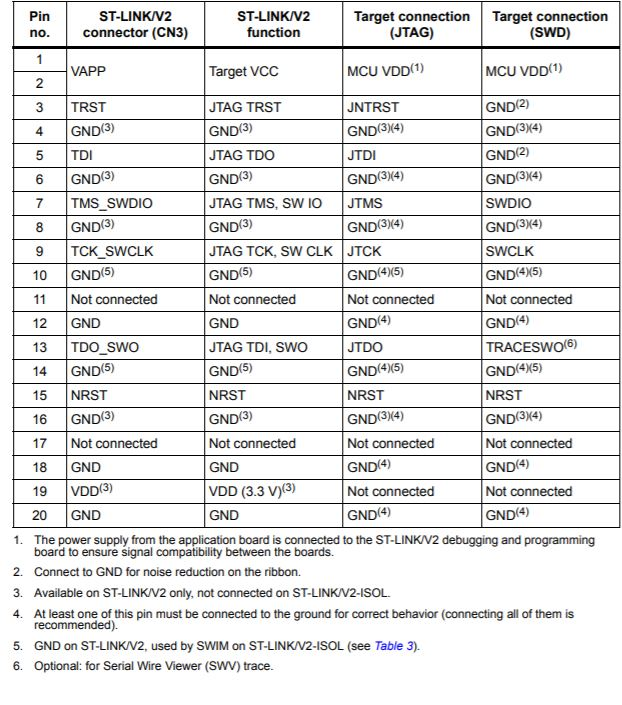
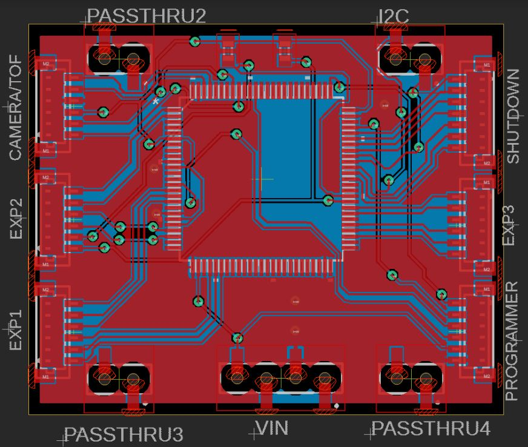
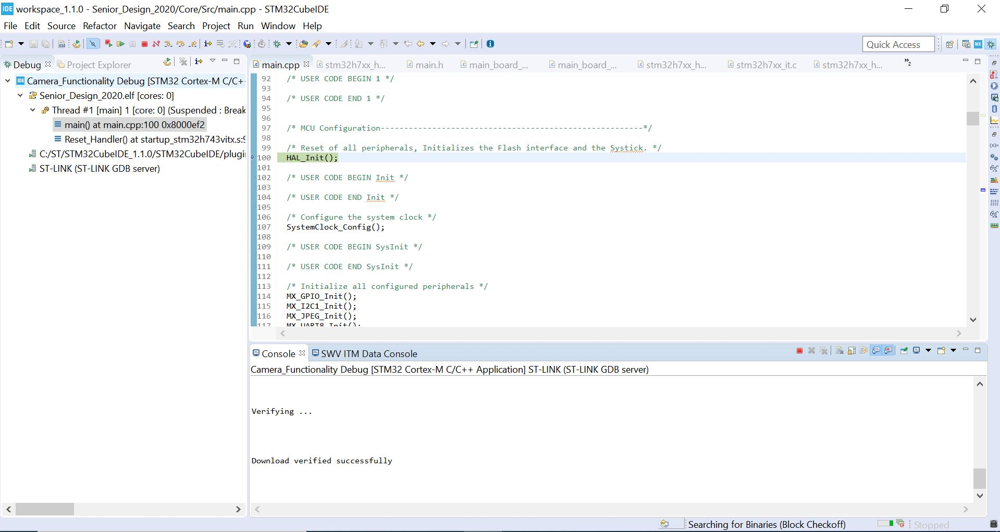

### Summary of Contents

Camera_Functionality is a previous state on the primary development board for this project that functions with the VC0706 serial camera from Adafruit. Use it if you wish to start from something more fresh.

Senior_Design_202 is the current iteration of this project with as many relevant features as are ready implemented into the flow. Several need further debugging, however, to the point where several features are still non-functional, especially related to the ToF sensors and any image processing.

The ToF_Sensors section contains a filter for the ToF sensor data that has been integrated into our current flow.

ToF-Arduino-Code contains an example set of code for using just two ToF sensors on an Arduino. Considering the adapted API is based on and almost identical to the Adafruit written API, this example is extremely useful.

### Pulling Project and Uploading to Board

First, it is worth noting that while you may use an IDE of your choice, we highly recommend the [STM32CubeIDE](https://www.st.com/en/development-tools/stm32cubeide.html) from STMicroelectronics, as it integrates CubeMX and importing the project is extremely painless. Upon downloading the IDE and finishing any necessary setup, go to File->Open Project from Filesystem and then select Senior_Design_2020 from this repository. 

##### ST-Link/V2 and Debugging Settings

Connect your ST-Link/V2 to your computer and go to Debug settings. The Senior_Design_2020 debug settings should be correctly saved, but if they are not, please enter in the following under Run->Debug Configurations->Debugger:

- Ensure that the "Autostart local GDB server" option is enabled.
- Ensure that you are using the SWD and not the JTAG interface. It should not be necessary, but if desirable to see if your ST-Link/V2 is connected to your computer, you can scan for a specific ST-Link S/N. 
- Your acces port should say "0-Cortex M7."
- Ensure that "Software system reset" is enabled.
- This last part is crucial if you want to view debugging messages in the IDE's terminal. Make sure that the Serial Wire Viewer is enabled and that the Core Clock option matches your microcontroller's core clock according to the clock tree in CubeMX. For the purposes of this project, we typically run as fast as possible at 480 MHz, so make sure that if you change the microcontroller's clock speed that you adjust this setting accordingly. The SWO frequency is up to preference, and the port number just needs to not be a reserved port. 

All other settings should be default enabled as necessary. Some of the above are similarly defaults, but are mentioned due to their necessity. 

##### Connecting Board to ST-Link/V2

As of now, you will likely have to connect the programming port on our board to the JTAG/SWD 20 pin header on your ST-Link/V2 using free wires, so this section will go over how to connect the two in some detail. Observe the below pictures as you are making connections:

The pins of interest to us are any of the VDD pins, any of the GND pins, pin 7 which functions as our SWDIO, pin 9 which functions as our SWCLK, pin 13 which functions as our TRACESWO, and pin 15 which functions as our NRST. All other pins can remain disconnected, although in the future it is worth keeping in mind that better ground contact will result in more reliable programming and debugging. 

Now observe the below image of our board's layout and find the programming port:

The pins are laid out as such from top to bottom:

- SWCLK
- SWDIO
- TRACESWO
- NRST
- VDD
- GND

Appropriately connect the pins according to the above artifacts and information. Connect directly to the board of the ST-Link/V2 for the best programming and debugging consistency. If you are able to program or if the error message from the ST-Link/V2 does not say that it cannot find a target device, you are most likely correctly connected. 

##### Programming and Debugging through Serial Wire Viewer

At this point, you should be ready to program the board. Compile and run the program through Run->Debug, assuming your configurations are correct. It should properly connect and list some statistics concerning the connection and the size of the binary being uploaded to the main board. After this is finished, you should appear paused at a breakpoint and your screen should look a lot like this:

You can open the SWV ITM data console on the sidebar to the right if it is not enabled by default. From there, click on the Configure Trace button represented by a wrench and screw in the SWV ITM data console. The only absolutely necessary step here is to enable 0, but you may also want to enable a comparator for future analysis. Upon finishing, exit the settings and click on the red button adjacent to the settings button to begin collecting data. Your program should run from here correctly. 
